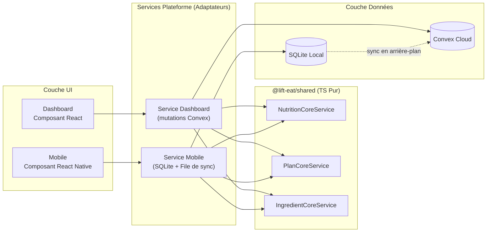
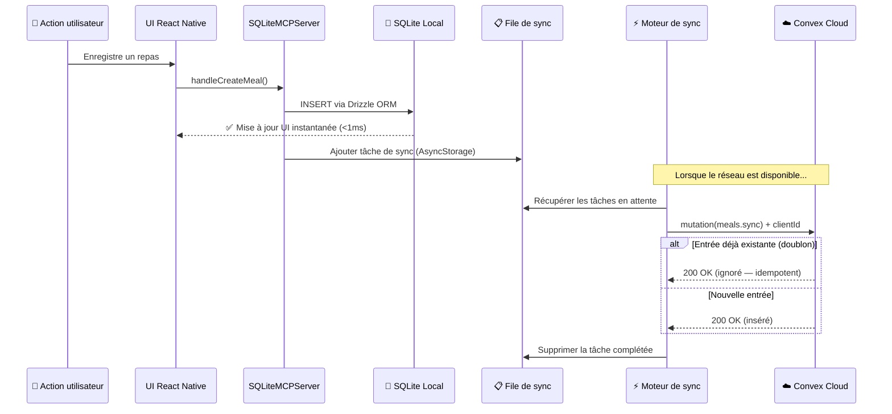
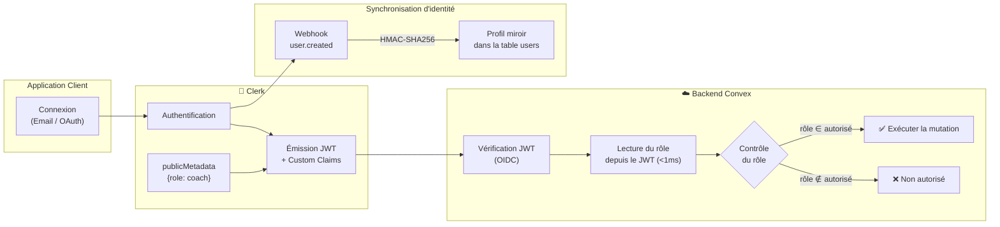
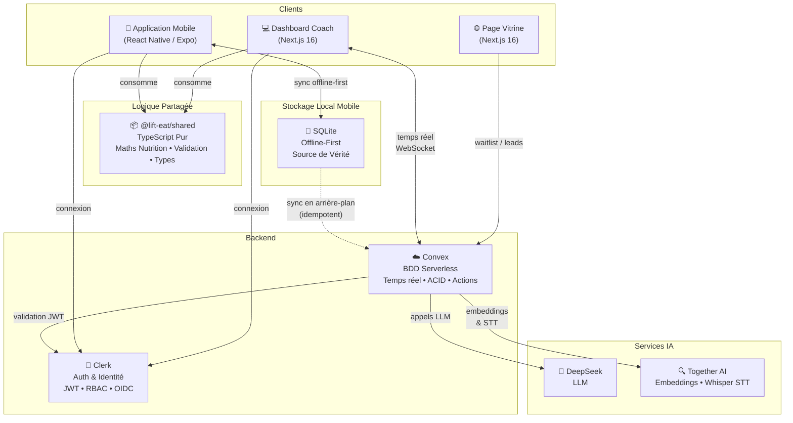
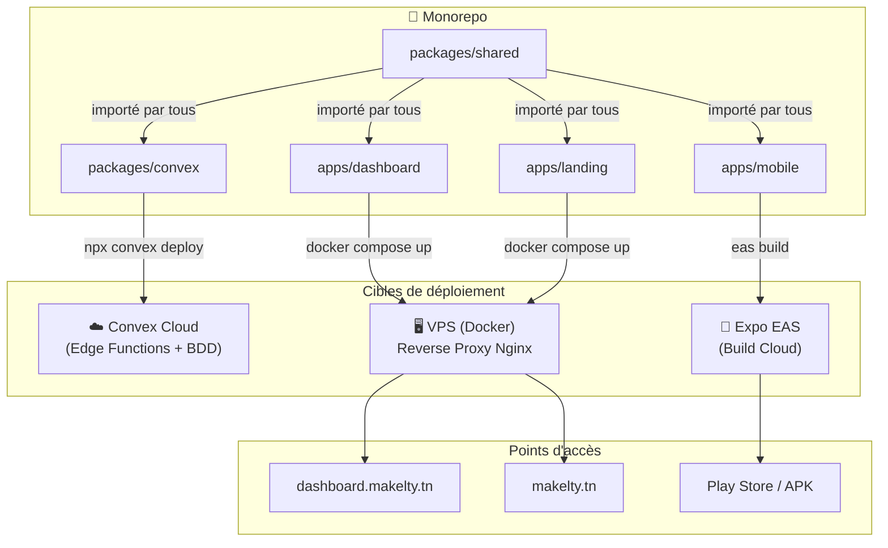
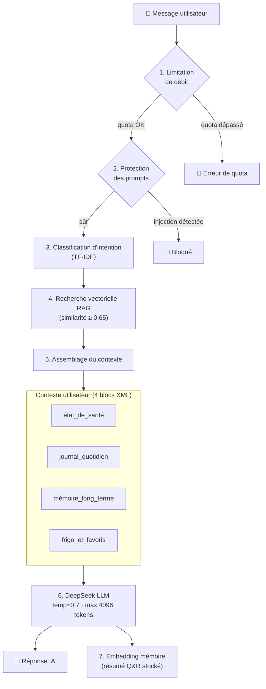
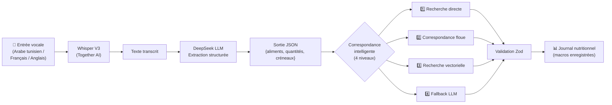

<p align="right">
  <a href="README.en.md">🇬🇧 English</a> | <strong>🇫🇷 Français</strong>
</p>

<p align="center">
  <h1 align="center">Makelty</h1>
  <p align="center">
    <strong>Le système d'exploitation du coaching nutritionnel haute performance.</strong>
  </p>
  <p align="center">
    Une plateforme FoodTech SaaS en production — construite en monorepo TypeScript — au service des nutritionnistes et de leurs clients sur mobile et web.
  </p>
</p>

<p align="center">
  
  
  
  
  
</p>

---

## Table des matières

- [Vue d'ensemble](#vue-densemble)
- [Contexte produit](#contexte-produit)
- [Pourquoi ce dépôt existe](#pourquoi-ce-dépôt-existe)
- [Contexte de production](#contexte-de-production)
- [Composants principaux de la plateforme](#composants-principaux-de-la-plateforme)
  - [Application Mobile (B2C)](#application-mobile-b2c)
  - [Dashboard Coach (B2B)](#dashboard-coach-b2b)
  - [Couche IA](#couche-ia)
- [Stack technique](#stack-technique)
- [Points forts de l'architecture](#points-forts-de-larchitecture)
- [Architecture générale](#architecture-générale)
- [Fonctionnalités clés](#fonctionnalités-clés)
- [Points forts d'ingénierie](#points-forts-dingénierie)
- [Capacités IA](#capacités-ia)
- [Notes d'architecture](#notes-darchitecture)
- [Périmètre du dépôt](#périmètre-du-dépôt)
- [Captures d'écran](#captures-décran)
- [Documentation complémentaire](#documentation-complémentaire)
- [Liens publics](#liens-publics)
- [Équipe](#équipe)
- [Avertissement](#avertissement)

---

## Vue d'ensemble

**Makelty** est une startup FoodTech tunisienne qui construit une plateforme de coaching unifiée pour l'industrie de la nutrition et du fitness. Le système connecte deux bases d'utilisateurs à travers un écosystème technique unique et cohérent :

- **Les coachs et nutritionnistes** (B2B) gèrent leurs clients, conçoivent des plans macro-nutritionnels précis, suivent l'adhérence, communiquent en temps réel et gèrent la facturation — le tout depuis un dashboard web professionnel.
- **Les utilisateurs finaux** (B2C) suivent leurs repas, enregistrent leur poids et leur hydratation, interagissent avec des assistants IA nutritionnels et suivent leurs plans personnalisés — le tout depuis une application mobile conçue pour fonctionner parfaitement hors ligne.

Le produit n'est pas un prototype. C'est un **système en production** qui gère de vrais utilisateurs, de vraies données nutritionnelles et de vrais workflows de coaching. Le codebase dépasse les **250 000 lignes de TypeScript** réparties sur trois applications, trois packages partagés et un backend serverless — le tout géré dans un seul monorepo.

---

## Contexte produit

### Le problème

Les coachs en nutrition et les professionnels du fitness indépendants opèrent avec des outils fragmentés :

| Tâche | Outil typique |
|-------|--------------|
| Communication client | WhatsApp |
| Plans nutritionnels | Excel / PDF |
| Suivi des paiements | Virements bancaires, notes manuelles |
| Suivi de la progression | Tableurs dispersés |

Cette fragmentation limite la capacité d'un coach à environ 20–30 clients avant que la charge administrative ne dégrade la qualité ou ne provoque un burn-out.

### La solution

Makelty consolide l'ensemble du workflow de coaching en une seule plateforme avec une synchronisation temps réel inférieure à 100ms entre le dashboard web du coach et l'application mobile de chaque client. L'objectif est de créer un levier opérationnel : permettre à un coach de gérer **200+ clients** en se concentrant sur la qualité du coaching plutôt que sur la logistique.

### Utilisateurs cibles

| Segment | Interface | Description |
|---------|-----------|-------------|
| **Coachs en nutrition** | Dashboard Web | CRM complet, constructeur de plans, messagerie, facturation |
| **Professionnels du fitness** | Dashboard Web | Suivi des clients, gestion des programmes |
| **Utilisateurs finaux / clients** | Application Mobile | Suivi quotidien, assistant IA, expérience offline-first |

---

## Pourquoi ce dépôt existe

Le code source complet de Makelty est **privé** et le restera. Ce dépôt a pour vocation de servir :

1. **D'étude de cas architecturale** — documentant les décisions d'ingénierie, la conception système et les compromis techniques derrière une plateforme FoodTech en production.
2. **De pièce de portfolio technique** — démontrant la maîtrise de l'architecture monorepo, de l'ingénierie mobile offline-first, des systèmes temps réel, des pipelines IA/RAG et du TypeScript full-stack.
3. **De référence pour la communauté** — offrant des exemples concrets de patterns comme les couches de services partagées, les moteurs de synchronisation offline et le partage de code multi-plateforme.

Aucun code source propriétaire, clé API, schéma de base de données ou logique métier sensible n'est exposé dans ce dépôt.

---

## Contexte de production

| Aspect | Détail |
|--------|--------|
| **Statut** | En production (v2.0.0) |
| **Disponibilité mobile** | Précédemment publié sur le Google Play Store sous le nom « Lift & Eat » |
| **Domaine du dashboard** | `dashboard.makelty.tn` |
| **Backend** | Convex Cloud (serverless, déploiements sans interruption) |
| **Hébergement web** | Conteneurs Docker sur VPS avec reverse proxy Nginx |
| **Builds mobile** | Expo Application Services (EAS) — binaires natifs compilés dans le cloud |
| **Localisation** | Français, Anglais, Arabe (avec support RTL complet) |
| **Devise** | TND (Dinar Tunisien) — méthodes de paiement locales supportées |

---

## Composants principaux de la plateforme

### Application Mobile (B2C)

L'application mobile destinée aux clients est une application **React Native** construite avec **Expo SDK 53**, conçue autour d'une architecture **offline-first** où la base de données SQLite locale est la source de vérité immédiate pour l'interface utilisateur.

**Caractéristiques clés :**

- **Interactions sans latence** — Toutes les lectures et écritures passent d'abord par SQLite local. L'interface se met à jour en moins d'1ms sans aucun indicateur de chargement lors des opérations courantes.
- **Synchronisation en arrière-plan** — Un moteur de synchronisation propriétaire met en file d'attente les mutations dans AsyncStorage et les rejoue vers le backend Convex lorsque la connectivité est disponible. Des clés d'idempotence (`clientId` UUID) empêchent les écritures en double lors des tentatives de renvoi.
- **Onboarding en 7 étapes** — Parcours guidé collectant les données biométriques (genre, taille, poids, niveau d'activité, objectifs) pour calculer le TDEE et les cibles macro personnalisées via l'équation de Mifflin-St Jeor.
- **Scanner de codes-barres** — Scan de produits par caméra intégré avec OpenFoodFacts pour une consultation nutritionnelle instantanée.
- **Gamification** — Suivi des séries (streaks), badges de réussite et partage communautaire de plans pour stimuler l'engagement.
- **Trilingue** — Support i18n complet pour les interfaces en Français, Anglais et Arabe.

### Dashboard Coach (B2B)

Le dashboard destiné aux coachs est une application **Next.js 16** utilisant l'App Router, construite avec **shadcn/ui** et **TailwindCSS** pour un design system premium et accessible.

**Caractéristiques clés :**

- **CRM Client 360°** — Profils clients avec progression pondérale, journaux d'hydratation, taux d'adhérence aux repas, chronologies d'activité et système de tags.
- **Constructeur de plans nutritionnels** — Assistant multi-étapes pour créer des plans nutritionnels au macronutriment près. Supporte les templates de plans pour la réutilisation entre clients.
- **Base d'ingrédients certifiée** — 160+ ingrédients certifiés INNTA (Institut National de Nutrition et de Technologie Alimentaire de Tunisie) avec des valeurs nutritionnelles verrouillées. 300+ repas traditionnels tunisiens et méditerranéens.
- **Messagerie temps réel** — Chat alimenté par WebSocket avec accusés de réception, indicateurs de frappe, pièces jointes et modèles de réponses rapides.
- **Gestion financière** — Génération de factures, suivi des paiements (Espèces, Virement bancaire, Flouci — paiement mobile tunisien), analytique des revenus et export PDF.
- **Calendrier de consultations** — Planification des disponibilités et gestion des rendez-vous.
- **Panel Super Admin** — Gestion des utilisateurs à l'échelle de la plateforme, génération de codes d'activation, modération de contenu, analytique et configuration système.

### Couche IA

Makelty intègre deux agents IA spécialisés exclusivement en nutrition :

1. **Assistant nutritionnel conversationnel** — Un chatbot alimenté par RAG disponible sur mobile et dashboard, propulsé par DeepSeek LLM avec une conscience contextuelle du plan actif de l'utilisateur, de son apport quotidien, de son historique de poids et de ses favoris.
2. **Agent de logging alimentaire vocal** — Un pipeline vocal complet (Audio → STT → Extraction structurée → Correspondance en base → Enregistrement) optimisé pour la reconnaissance du dialecte arabe tunisien.

Les deux agents opèrent dans le cadre de quotas de tokens stricts, de protections contre l'injection de prompts et de schémas de sortie validés par Zod. Plus de détails dans [Capacités IA](#capacités-ia).

---

## Stack technique

| Domaine | Technologies |
|---------|-------------|
| **Monorepo** | Turborepo, pnpm workspaces |
| **Mobile** | React Native 0.79, Expo SDK 53, Expo Router, NativeWind v4 |
| **BDD locale mobile** | SQLite (`expo-sqlite`), Drizzle ORM |
| **État mobile** | Zustand, TanStack Query v5 (avec persistance) |
| **Dashboard** | Next.js 16, React 19, App Router |
| **UI Dashboard** | shadcn/ui, Radix UI, TailwindCSS v4, Recharts |
| **Page vitrine** | Next.js 16, TailwindCSS v4, GSAP, Framer Motion, next-intl |
| **Backend & Base de données** | Convex (backend TypeScript serverless avec souscriptions temps réel) |
| **Authentification** | Clerk (JWT + OIDC, custom claims pour RBAC) |
| **IA — LLM** | DeepSeek (`deepseek-chat`) |
| **IA — Embeddings** | Together AI (`multilingual-e5-large-instruct`, 1024 dimensions) |
| **IA — STT** | Together AI (`openai/whisper-large-v3`) |
| **Médias** | Cloudinary (distribution edge, transformations) |
| **Déploiement** | Docker, Nginx, Vercel, Expo EAS |

---

## Points forts de l'architecture

### 1. Monorepo avec noyau partagé

Le projet est structuré en **monorepo Turborepo** avec des frontières strictes :

```text
lift-and-eat/
├── apps/
│   ├── mobile/          →  React Native (Expo SDK 53) — App Client
│   ├── dashboard/       →  Next.js 16 (App Router) — Dashboard Coach
│   └── landing/         →  Next.js 16 — Site Vitrine Public
│
└── packages/
    ├── shared/          →  Logique Métier Universelle & Types (TS pur)
    ├── convex/          →  Backend Serverless & Base de Données
    └── ui/              →  Design System Partagé (shadcn/ui, Radix)
```

### 2. La philosophie du « noyau partagé »

La pierre angulaire architecturale : **ni l'application Mobile ni le Dashboard n'implémentent de logique métier**. 100% des calculs nutritionnels, de la validation des plans, de la distribution des macros et des transformations de données résident dans `packages/shared` sous forme de fonctions TypeScript pures — aucun import de framework, aucun effet de bord.

> Un bug corrigé dans le package partagé est instantanément résolu sur iOS, Android et Web simultanément.

### 3. Pattern de couche de services

Les composants UI n'interrogent jamais la base de données directement. Ils invoquent des wrappers de services spécifiques à la plateforme qui délèguent au noyau partagé :

- **Services Dashboard** → Validation via le noyau partagé → Exécution des mutations Convex
- **Services Mobile** → Validation via le noyau partagé → Écriture en SQLite local → Mise en file de synchronisation



### 4. Moteur mobile offline-first

L'application mobile utilise une couche inspirée du **Model Context Protocol (MCP)** — `SQLiteMCPServer` — comme API locale monolithique. Les composants appellent des handlers spécifiques au domaine qui écrivent dans SQLite via Drizzle ORM. Un moteur de synchronisation en arrière-plan traite une file de mutations en attente lorsque la connectivité est rétablie, en utilisant des clés d'idempotence pour éviter les doublons.



### 5. Dashboard temps réel

Le dashboard coach exploite les souscriptions WebSocket natives de Convex. Lorsqu'un client met à jour son poids sur mobile et que les données se synchronisent vers le cloud, le dashboard du coach se re-rend instantanément — sans polling, sans rafraîchissement manuel.

### 6. Authentification & RBAC

Clerk gère l'authentification en externe. Les rôles (`user`, `coach`, `admin`, `superadmin`) sont injectés dans le JWT via des custom claims. Convex valide les rôles en mémoire depuis le JWT — aucune requête supplémentaire en base de données nécessaire — permettant des vérifications d'autorisation en moins d'une milliseconde.



---

## Architecture générale



---

## Fonctionnalités clés

### Pour les utilisateurs finaux (Mobile — B2C)

- **Assistant IA nutritionnel** — Chatbot contextuel conscient du plan de l'utilisateur, de son apport quotidien, de ses tendances de poids et de ses préférences alimentaires. Alimenté par un RAG sur la base de données alimentaire de la plateforme.
- **Enregistrement vocal des repas** — Dictez vos repas en arabe tunisien, français ou anglais. Le système transcrit, extrait les données alimentaires structurées, fait la correspondance avec la base de données et enregistre les macros automatiquement.
- **Suivi de repas de précision** — Créez des repas personnalisés, recherchez dans une base de données curatée ou scannez des codes-barres (intégration OpenFoodFacts). Macros calculées pour 100g avec ajustement dynamique des portions.
- **Suivi biométrique** — Poids quotidien, hydratation (mL), compteur de pas, avec tendances historiques et analytique.
- **Plans nutritionnels** — Consultez et suivez les plans assignés par le coach ou auto-créés avec une structure jour par jour, créneau par créneau (petit-déjeuner, déjeuner, dîner, collation).
- **Communauté** — Parcourez et clonez les plans partagés publiquement par d'autres utilisateurs.
- **Gamification** — Séries (streaks), badges de réussite et récompenses d'engagement.
- **Accès Premium** — Système de codes d'activation pour les fonctionnalités premium (modèle de monétisation bootstrappé).

### Pour les coachs (Dashboard — B2B)

- **CRM Client** — Gestion complète du cycle de vie avec suivi de statut (actif, en pause, en attente, terminé), tags, notes et rapports hebdomadaires.
- **Constructeur de plans nutritionnels** — Création guidée par assistant avec calcul automatique TDEE/BMR, système de templates pour la réutilisation et assignation directe aux clients.
- **Bibliothèque alimentaire certifiée** — Base d'ingrédients certifiée INNTA avec valeurs nutritionnelles verrouillées. 300+ repas traditionnels curatés.
- **Messagerie temps réel** — Chat avec accusés de réception, indicateurs de frappe, pièces jointes et modèles de réponses rapides.
- **Outils financiers** — Gestion des factures, suivi multi-méthodes de paiement (Espèces, Virement bancaire, Flouci), analytique des revenus et export PDF.
- **Calendrier de consultations** — Planification des disponibilités et gestion des rendez-vous.
- **Assistant IA** — Le même assistant alimenté par RAG, disponible pour les coachs pour la recherche nutritionnelle.

### Pour les opérateurs de la plateforme (Panel Admin)

- **Gestion des utilisateurs et coachs** — Visibilité à l'échelle de la plateforme avec gestion des rôles.
- **Moteur de codes d'activation** — Génération en lot de codes de licence pour la monétisation B2B et B2C.
- **Curation de contenu** — Gestion de la base de données globale d'ingrédients et de repas avec outils de seed.
- **Analytique & Modération** — Suivi des événements, collecte de feedback, modération communautaire.

---

## Points forts d'ingénierie

### L'offline-first comme citoyen de première classe

L'application mobile a été conçue dès le premier jour pour des environnements à connectivité instable — salles de sport, supermarchés, zones rurales. Le pattern `SQLiteMCPServer` garantit que :

- **Les lectures** ne touchent jamais le réseau. 99% des requêtes (`getDailyPlan`, `getProgress`) sont résolues contre le SQLite local.
- **Les écritures** sont optimistes. L'UI reflète les changements instantanément, et une file en arrière-plan rejoue les mutations vers Convex de manière asynchrone.
- **La résolution de conflits** utilise des clés d'idempotence et un service d'hydratation qui fusionne l'état distant dans la base locale tout en respectant les écritures locales en attente.

### Typage de bout en bout (End-to-End Type Safety)

De la définition du schéma Convex (`packages/convex/src/schema.ts`) jusqu'au composant UI final, chaque structure de données est typée statiquement. Le package partagé du monorepo exporte des interfaces TypeScript consommées par les trois applications, éliminant une classe entière d'erreurs à l'exécution.

### Précision nutritionnelle

Tous les calculs nutritionnels (BMR, TDEE, distribution des macros, facteurs de rendement de cuisson, normalisation des portions) sont implémentés comme des **fonctions pures** dans le noyau partagé. Le système prend en compte :

- L'équation de Mifflin-St Jeor avec multiplicateurs d'activité
- La distribution des macros spécifique aux objectifs (sèche, prise de masse, maintien) avec protéines fixées à 2.2g/kg
- Les ajustements de méthode de cuisson (poids cru vs. cuit, facteurs d'hydratation/déshydratation)
- Le calcul d'adhérence avec des bandes de tolérance de ±10%

### Conformité de la logique partagée

Un audit d'architecture interne a confirmé :

| Métrique | Dashboard | Mobile |
|----------|-----------|--------|
| Conformité au noyau partagé | **9/10** | **8/10** |
| Enums depuis shared | ✅ 100% | ✅ 100% |
| Constantes depuis shared | ✅ 100% | ✅ 100% (migrées) |
| Services wrappant shared | ✅ | ✅ (audité, aucune duplication) |

### Pipeline de déploiement

| Composant | Stratégie |
|-----------|-----------|
| **Backend Convex** | Déploiement atomique sans interruption via `npx convex deploy` |
| **Applications web** | Docker Compose sur VPS avec optimisation du cache Turborepo et routage Nginx |
| **Application mobile** | Builds cloud Expo EAS avec séparation stricte des profils (dev / preview / production) |
| **Packages partagés** | Un changement dans `packages/shared` se propage automatiquement aux trois cibles de déploiement |



---

## Capacités IA

### Assistant RAG conversationnel

L'assistant IA n'est pas un chatbot générique. Chaque requête passe par un **pipeline en 7 étapes** :

1. **Limitation de débit** — Applique des quotas de tokens quotidiens (50k gratuit / 100k premium)
2. **Protection des prompts** — Détecte et bloque les tentatives d'injection
3. **Classification d'intention** — Un classifieur TF-IDF catégorise la requête (`meal_request`, `plan_request`, `progress_analysis`, `general`)
4. **Recherche RAG** — Recherche vectorielle par similarité (seuil : 0.65) sur les repas, ingrédients et la mémoire utilisateur
5. **Injection du contexte utilisateur** — Quatre blocs XML structurés : état de santé, journal quotidien, mémoire long terme, favoris/frigo
6. **Génération LLM** — DeepSeek avec température 0.7, max 4096 tokens, timeout 30s
7. **Embedding mémoire** — Le résumé Q&R est vectorisé pour la mémoire long terme de l'utilisateur



### Pipeline de logging alimentaire vocal

Un pipeline complet **Audio → Données structurées → Base de données** :

1. **STT** — Transcription Whisper Large V3 avec prompts optimisés pour le dialecte arabe tunisien
2. **Extraction** — Le LLM extrait les aliments, quantités et créneaux de repas en JSON structuré
3. **Correspondance à 4 niveaux** — Recherche directe → Correspondance floue (synonymes, i18n) → Recherche vectorielle → Estimation LLM en fallback
4. **Validation** — Les schémas Zod garantissent que la sortie correspond exactement au schéma de la base de données avant toute écriture
5. **Enregistrement** — Les éléments identifiés sont enregistrés dans le journal nutritionnel quotidien de l'utilisateur



### Architecture des embeddings

| Paramètre | Valeur |
|-----------|--------|
| Modèle | `intfloat/multilingual-e5-large-instruct` |
| Dimensions | 1024 |
| Stockage | Index vectoriel Convex (table `ai_embeddings`) |
| Sources indexées | Repas, ingrédients, mémoire conversationnelle utilisateur |
| Support batch | Oui (un seul appel API pour N documents) |

### Mesures de sécurité

- Toutes les clés API sont exclusivement côté serveur (actions Convex) — jamais exposées aux clients
- Détection d'injection de prompts par correspondance de patterns connus
- Entrée utilisateur isolée dans des balises XML `<user_input>`
- Longueur des messages limitée à 2 000 caractères
- Interactions vocales limitées à 15/mois (tier gratuit)
- Application RBAC via custom claims JWT sur tous les endpoints IA

---

## Notes d'architecture

### Pourquoi Convex au lieu de REST + PostgreSQL ?

Convex a été choisi pour ses forces natives dans ce cas d'usage :

- **Temps réel par défaut** — Les souscriptions WebSocket alimentent les mises à jour live du dashboard sans infrastructure additionnelle.
- **TypeScript de bout en bout** — Schéma, requêtes, mutations et actions sont tous en TypeScript. Aucune couche de mapping ORM ni duplication de contrat d'API.
- **Transactions ACID** — Les mutations sont automatiquement rejouées en cas de conflit de concurrence optimiste.
- **Recherche vectorielle intégrée** — Élimine le besoin d'une base de données vectorielle séparée pour le pipeline RAG.
- **Mise à l'échelle serverless** — Aucune gestion d'infrastructure pour la couche backend.

### Pourquoi Clerk au lieu d'une authentification custom ?

- Externalise le hachage de mots de passe, l'OTP, OAuth et la gestion des sessions vers un fournisseur éprouvé.
- Les custom claims dans le JWT permettent un **RBAC sans latence** — Convex lit le rôle depuis le token en mémoire sans interroger la base de données.
- Le pipeline webhook (`user.created` → vérification HMAC-SHA256 → mutation interne) maintient une table utilisateur miroir dans Convex pour l'intégrité relationnelle.

### Pourquoi SQLite + Convex (double base de données) ?

L'application mobile doit fonctionner dans des environnements sans connectivité. Les architectures traditionnelles cloud-only échouent ici. L'approche double base de données offre :

- **UI instantanée** — SQLite sert toutes les lectures localement.
- **Résilience** — L'application est pleinement fonctionnelle hors ligne.
- **Cohérence à terme** — La synchronisation en arrière-plan avec résolution de conflits assure l'intégrité des données.
- **Efficacité des coûts** — Réduit les lectures Convex de ~99% lors de l'utilisation mobile normale.

---

## Périmètre du dépôt

> **Ce dépôt est une vitrine de documentation technique et d'architecture.**
> Il ne contient pas le code source complet de la plateforme Makelty.

### Ce que ce dépôt inclut :
- ✅ Documentation d'architecture et justification des choix de conception
- ✅ Diagrammes de composants de haut niveau et descriptions des flux de données
- ✅ Registre des décisions d'ingénierie
- ✅ Inventaire des fonctionnalités et aperçu des capacités
- ✅ Documentation de l'architecture du système IA
- ✅ Topologie et stratégie de déploiement

### Ce que ce dépôt n'inclut PAS :
- ❌ Code source des applications
- ❌ Schémas de base de données ou fichiers de migration
- ❌ Clés API, secrets ou variables d'environnement
- ❌ Logique métier interne ou algorithmes propriétaires
- ❌ Données utilisateur ou configuration de production

---

## Captures d'écran

> 📸 Des captures d'écran de l'application mobile et du dashboard coach seront ajoutées ici.
> Cette section sera peuplée avec des captures UI sélectionnées démontrant l'expérience produit sans exposer les détails d'implémentation interne.

<!--
Visuels suggérés :
- Mobile : Parcours d'onboarding, tracker quotidien, chat IA, création de repas
- Dashboard : Vue CRM client, constructeur de plans, messagerie, analytique
- Vitrine : Hero page d'accueil, sections fonctionnalités
-->

---

## Documentation complémentaire

Des analyses détaillées sont disponibles (ou prévues) dans le répertoire `/docs` :

| Document | Description |
|----------|-------------|
| `docs/architecture.md` | Plongée dans l'architecture système — structure monorepo, flux de données, couches de services |
| `docs/features.md` | Inventaire complet des fonctionnalités par plateforme et rôle utilisateur |
| `docs/decisions.md` | Registre des décisions d'architecture (ADR) — justification des choix techniques clés |
| `docs/production-notes.md` | Contexte de déploiement en production, topologie d'infrastructure, monitoring |
| `docs/ai-system.md` | Architecture du pipeline IA — RAG, embeddings, logging vocal, prompt engineering |
| `docs/offline-engine.md` | Moteur offline-first — SQLite MCP, file de sync, résolution de conflits, hydratation |

---

## Liens publics

| Ressource | URL |
|-----------|-----|
| **Dashboard** | [dashboard.makelty.tn](https://dashboard.makelty.tn) |
| **LinkedIn — Oussama Souissi** | [linkedin.com/in/oussama-souissi-289844ba](https://www.linkedin.com/in/oussama-souissi-289844ba) |
| **LinkedIn — Hamdi Jouini** | [linkedin.com/in/hamdi-jouini-7aa47828b](https://www.linkedin.com/in/hamdi-jouini-7aa47828b) |
| **LinkedIn — Ichrak Haddad** | [linkedin.com/in/haddad-ichrak](https://www.linkedin.com/in/haddad-ichrak/) |

---

## Équipe

| Photo | Nom | Rôle |
|-------|-----|------|
|  | [**Oussama Souissi**](https://www.linkedin.com/in/oussama-souissi-289844ba) | CTO & Co-Fondateur |
|  | [**Hamdi Jouini**](https://www.linkedin.com/in/hamdi-jouini-7aa47828b/) | CEO & Co-Fondateur |
|  | [**Ichrak Haddad**](https://www.linkedin.com/in/haddad-ichrak/) | Nutritionniste - Diététicienne & Co-Fondatrice |

---

## Avertissement

Ce dépôt est une **étude de cas architecturale publique**. Le code source complet de Makelty est propriétaire et maintenu dans un dépôt privé.

Aucune logique métier confidentielle, donnée utilisateur, identifiant API ou détail d'implémentation interne n'est exposé dans ce dépôt. Toutes les descriptions techniques représentent l'architecture du système à un niveau de documentation approprié pour une consultation publique.

L'application mobile était précédemment disponible sur le Google Play Store sous le nom **« Lift & Eat »**. Le produit et l'entreprise ont depuis été rebrandés en **Makelty**.

---

<p align="center">
  <sub>Construit avec rigueur à Tunis, Tunisie 🇹🇳</sub>
</p>
