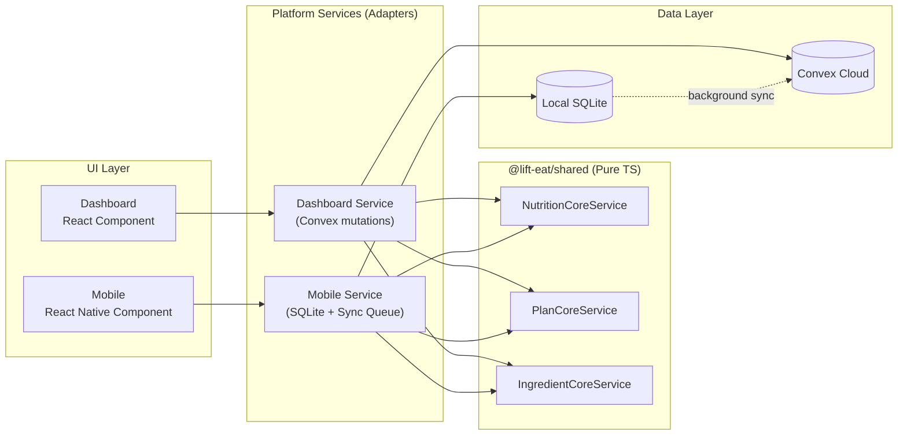
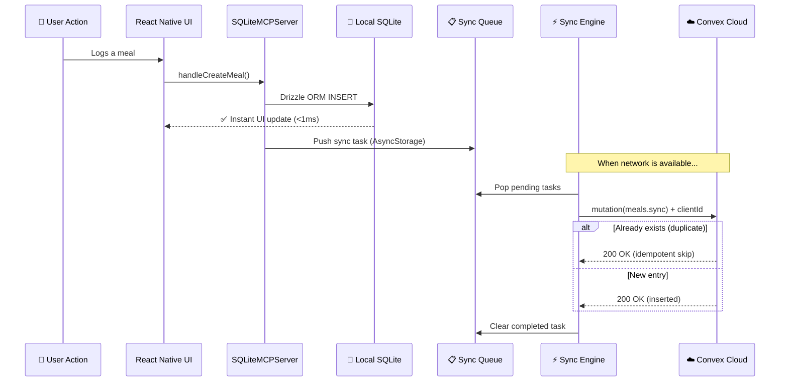
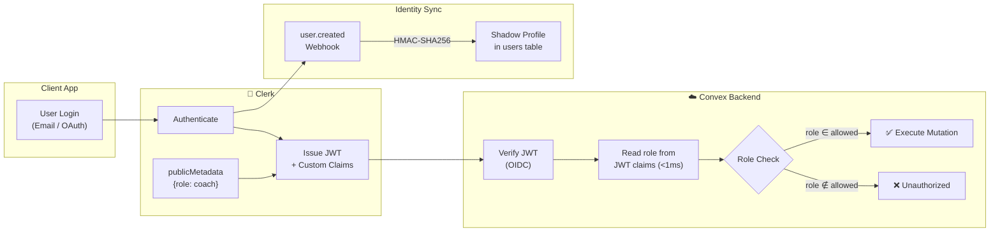
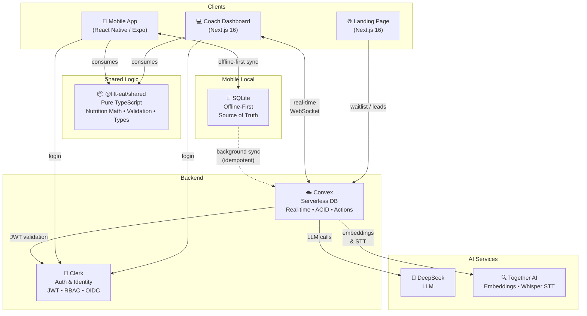
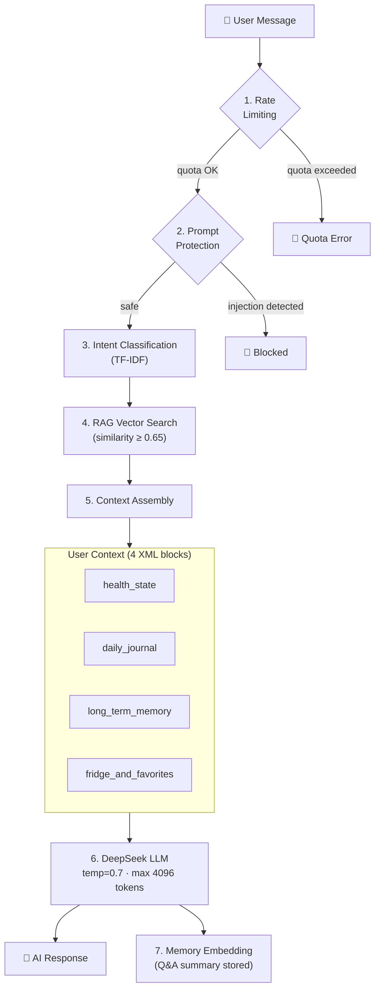
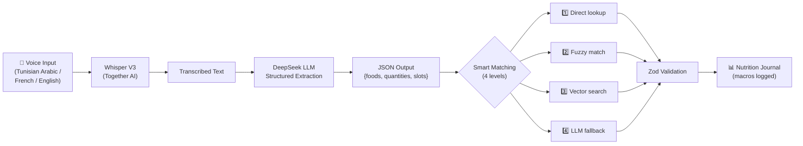

<p align="center">
  <h1 align="center">Makelty</h1>
  <p align="center">
    <strong>The operating system for high-performance nutrition coaching.</strong>
  </p>
  <p align="center">
    A production-grade FoodTech SaaS platform — built as a TypeScript monorepo — serving nutritionists and their clients across mobile and web.
  </p>
</p>

<p align="center">
  
  
  
  
  
</p>

---

## Table of Contents

- [Overview](#overview)
- [Product Context](#product-context)
- [Why This Repository Exists](#why-this-repository-exists)
- [Production Context](#production-context)
- [Core Platform Components](#core-platform-components)
  - [Mobile App (B2C)](#mobile-app-b2c)
  - [Web Dashboard (B2B)](#web-dashboard-b2b)
  - [AI Layer](#ai-layer)
- [Technical Stack](#technical-stack)
- [Architecture Highlights](#architecture-highlights)
- [High-Level Architecture](#high-level-architecture)
- [Key Features](#key-features)
- [Engineering Highlights](#engineering-highlights)
- [AI Capabilities](#ai-capabilities)
- [Architecture Notes](#architecture-notes)
- [Repository Scope](#repository-scope)
- [Screenshots & Visuals](#screenshots--visuals)
- [Next Documentation Files](#next-documentation-files)
- [Public Links](#public-links)
- [Team](#team)
- [Disclaimer](#disclaimer)

---

## Overview

**Makelty** is a Tunisian FoodTech startup building a unified coaching platform for the nutrition and fitness industry. The system connects two user bases through a single, coherent technical ecosystem:

- **Coaches and nutritionists** (B2B) manage clients, design precise macro-nutrient plans, track adherence, communicate in real time, and handle billing — all from a professional web dashboard.
- **End users** (B2C) track meals, log weight and hydration, interact with AI-powered nutrition assistants, and follow their personalized plans — all from a mobile app designed to work flawlessly offline.

The product is not a prototype. It is a **production system** handling real users, real nutrition data, and real coaching workflows. The codebase exceeds **250,000 lines of TypeScript** across three applications, three shared packages, and a serverless backend — all managed within a single monorepo.

---

## Product Context

### The Problem

Independent nutrition coaches and fitness professionals operate with fragmented tooling:

| Task | Typical Tool |
|------|-------------|
| Client communication | WhatsApp |
| Nutrition plans | Excel / PDF |
| Payment tracking | Bank transfers, manual notes |
| Progress monitoring | Scattered spreadsheets |

This fragmentation caps a coach's capacity at roughly 20–30 clients before administrative burden causes quality degradation or burnout.

### The Solution

Makelty consolidates the entire coaching workflow into a single platform with sub-100ms real-time synchronization between the coach's web dashboard and each client's mobile app. The goal is operational leverage: enable a coach to manage **200+ clients** while focusing on coaching quality rather than logistics.

### Target Users

| Segment | Interface | Description |
|---------|-----------|-------------|
| **Nutrition coaches** | Web Dashboard | Full CRM, plan builder, messaging, billing |
| **Fitness professionals** | Web Dashboard | Client tracking, program management |
| **End users / clients** | Mobile App | Daily tracking, AI assistant, offline-first experience |

---

## Why This Repository Exists

The full Makelty source code is **private** and will remain so. This repository serves as:

1. **An architecture case study** — documenting the engineering decisions, system design, and technical trade-offs behind a production FoodTech platform.
2. **A technical portfolio piece** — demonstrating proficiency in monorepo architecture, offline-first mobile engineering, real-time systems, AI/RAG pipelines, and full-stack TypeScript.
3. **A reference for the community** — providing concrete examples of patterns like shared service layers, offline synchronization engines, and multi-platform code sharing.

No proprietary source code, API keys, database schemas, or business-sensitive logic is exposed in this repository.

---

## Production Context

| Aspect | Detail |
|--------|--------|
| **Status** | Live in production (v2.0.0) |
| **Mobile availability** | Previously published on Google Play Store under the name "Lift & Eat" |
| **Dashboard domain** | `dashboard.makelty.tn` |
| **Backend** | Convex Cloud (serverless, zero-downtime deployments) |
| **Web hosting** | Docker containers on VPS with Nginx reverse proxy |
| **Mobile builds** | Expo Application Services (EAS) — cloud-compiled native binaries |
| **Localization** | French, English, Arabic (with full RTL support) |
| **Currency** | TND (Tunisian Dinar) — local payment methods supported |

---

## Core Platform Components

### Mobile App (B2C)

The client-facing mobile application is a **React Native** app built with **Expo SDK 53**, designed around an **offline-first** architecture where the local SQLite database is the immediate source of truth for the UI.

**Key characteristics:**

- **Zero-latency interactions** — All reads and writes hit local SQLite first. The UI updates in under 1ms with no loading spinners during normal operations.
- **Background synchronization** — A proprietary sync engine queues mutations in AsyncStorage and replays them against the Convex backend when connectivity is available. Idempotency keys (`clientId` UUIDs) prevent duplicate writes on retry.
- **7-step onboarding** — Guided flow collecting biometric data (gender, height, weight, activity level, goals) to calculate personalized TDEE and macro targets using the Mifflin-St Jeor equation.
- **Barcode scanning** — Camera-based product scanning integrated with OpenFoodFacts for instant nutritional lookups.
- **Gamification** — Streak tracking, achievement badges, and community plan sharing to drive engagement.
- **Trilingual** — Full i18n support for French, English, and Arabic interfaces.

### Web Dashboard (B2B)

The coach-facing dashboard is a **Next.js 16** application using the App Router, built with **shadcn/ui** and **TailwindCSS** for a premium, accessible design system.

**Key characteristics:**

- **360° Client CRM** — Client profiles with weight progression, hydration logs, meal adherence rates, activity timelines, and tagging.
- **Nutrition Plan Builder** — Multi-step wizard for creating macro-precise nutrition plans. Supports plan templates for reuse across clients.
- **Certified ingredient database** — 160+ INNTA-certified (Tunisian National Institute of Nutrition) ingredients with locked nutritional values. 300+ traditional Tunisian and Mediterranean meals.
- **Real-time messaging** — WebSocket-powered chat with read receipts, typing indicators, file attachments, and quick-reply templates.
- **Financial management** — Invoice generation, payment tracking (Cash, Bank Transfer, Flouci — Tunisia's mobile payment), revenue analytics, and PDF export.
- **Consultation calendar** — Availability scheduling and appointment management.
- **Super Admin panel** — Platform-wide user management, activation code generation, content moderation, analytics, and system configuration.

### AI Layer

Makelty integrates two specialized AI agents focused exclusively on nutrition:

1. **Conversational Nutrition Assistant** — A RAG-powered chatbot available on both mobile and dashboard, backed by DeepSeek LLM with contextual awareness of the user's active plan, daily intake, weight history, and favorites.
2. **Voice Food Logging Agent** — An end-to-end vocal pipeline (Audio → STT → Structured Extraction → Database Matching → Logging) optimized for Tunisian Arabic dialect recognition.

Both agents operate within strict token quotas, prompt injection protection, and Zod-validated output schemas. More details in [AI Capabilities](#ai-capabilities).

---

## Technical Stack

| Domain | Technologies |
|--------|-------------|
| **Monorepo** | Turborepo, pnpm workspaces |
| **Mobile** | React Native 0.79, Expo SDK 53, Expo Router, NativeWind v4 |
| **Mobile Local DB** | SQLite (`expo-sqlite`), Drizzle ORM |
| **Mobile State** | Zustand, TanStack Query v5 (with persistence) |
| **Dashboard** | Next.js 16, React 19, App Router |
| **Dashboard UI** | shadcn/ui, Radix UI, TailwindCSS v4, Recharts |
| **Landing Page** | Next.js 16, TailwindCSS v4, GSAP, Framer Motion, next-intl |
| **Backend & Database** | Convex (serverless TypeScript backend with real-time subscriptions) |
| **Authentication** | Clerk (JWT + OIDC, custom claims for RBAC) |
| **AI — LLM** | DeepSeek (`deepseek-chat`) |
| **AI — Embeddings** | Together AI (`multilingual-e5-large-instruct`, 1024-dim) |
| **AI — STT** | Together AI (`openai/whisper-large-v3`) |
| **Media** | Cloudinary (edge delivery, transformations) |
| **Deployment** | Docker, Nginx, Vercel, Expo EAS |

---

## Architecture Highlights

### 1. Monorepo with Shared Core

The project is structured as a **Turborepo monorepo** with strict boundaries:

```text
lift-and-eat/
├── apps/
│   ├── mobile/          →  React Native (Expo SDK 53) — Client App
│   ├── dashboard/       →  Next.js 16 (App Router) — Coach Dashboard
│   └── landing/         →  Next.js 16 — Public Marketing Site
│
└── packages/
    ├── shared/          →  Universal Business Logic & Types (pure TS)
    ├── convex/          →  Serverless Backend & Database
    └── ui/              →  Shared Design System (shadcn/ui, Radix)
```

### 2. The "Shared Core" Philosophy

The architectural cornerstone: **neither the Mobile app nor the Dashboard implement business logic**. 100% of nutritional calculations, plan validation, macro distribution, and data transformations live in `packages/shared` as pure TypeScript functions — no framework imports, no side effects.

> A bug fixed in the shared package is instantly resolved across iOS, Android, and Web simultaneously.

### 3. Service Layer Pattern

UI components never query the database directly. They invoke platform-specific service wrappers that delegate to the shared core:

- **Dashboard services** → Validate via shared core → Execute Convex mutations
- **Mobile services** → Validate via shared core → Write to local SQLite → Queue sync task



### 4. Offline-First Mobile Engine

The mobile app uses a **Model Context Protocol (MCP)** inspired layer — `SQLiteMCPServer` — as a monolithic local API. Components call domain-specific handlers that write to SQLite via Drizzle ORM. A background sync engine processes a queue of pending mutations when connectivity is restored, using idempotency keys to prevent duplicates.



### 5. Real-Time Dashboard

The coach dashboard leverages Convex's native WebSocket subscriptions. When a client updates their weight on mobile and the data syncs to the cloud, the coach's dashboard re-renders instantly — no polling, no manual refresh.

### 6. Authentication & RBAC

Clerk handles authentication externally. Roles (`user`, `coach`, `admin`, `superadmin`) are injected into the JWT as custom claims. Convex validates roles in-memory from the JWT — no additional database lookup required — achieving sub-millisecond authorization checks.



---

## High-Level Architecture



---

## Key Features

### For End Users (Mobile — B2C)

- **AI Nutrition Assistant** — Contextual chatbot aware of the user's plan, daily intake, weight trends, and food preferences. Powered by RAG over the platform's food database.
- **Voice Food Logging** — Dictate meals in Tunisian Arabic, French, or English. The system transcribes, extracts structured food data, matches against the database, and logs macros automatically.
- **Precision Meal Tracking** — Create custom meals, search a curated database, or scan barcodes (OpenFoodFacts integration). Macros calculated per 100g with dynamic portion adjustment.
- **Biometric Tracking** — Daily weight, hydration (mL), step count, with historical trends and analytics.
- **Nutrition Plans** — View and follow coach-assigned or self-created plans with day-by-day, slot-by-slot meal structure (breakfast, lunch, dinner, snack).
- **Community** — Browse and clone publicly shared plans from other users.
- **Gamification** — Streaks, achievement badges, and engagement rewards.
- **Premium Access** — Activation code system for premium features (bootstrapped monetization model).

### For Coaches (Dashboard — B2B)

- **Client CRM** — Full lifecycle management with status tracking (active, paused, pending, terminated), tags, notes, and weekly reports.
- **Nutrition Plan Builder** — Wizard-driven creation with TDEE/BMR auto-calculation, template system for reusability, and direct assignment to clients.
- **Certified Food Library** — INNTA-certified ingredient database with locked nutritional values. 300+ curated traditional meals.
- **Real-Time Messaging** — Chat with read receipts, typing indicators, attachments, and quick-reply templates.
- **Financial Tools** — Invoice management, multi-method payment tracking (Cash, Bank Transfer, Flouci), revenue analytics, and PDF export.
- **Consultation Calendar** — Availability scheduling and appointment management.
- **AI Assistant** — Same RAG-powered assistant available to coaches for nutritional research.

### For Platform Operators (Admin Panel)

- **User & Coach Management** — Platform-wide visibility with role management.
- **Activation Code Engine** — Batch generation of license codes for B2B and B2C monetization.
- **Content Curation** — Global ingredient and meal database management with seed tooling.
- **Analytics & Moderation** — Event tracking, feedback collection, community moderation.

---

## Engineering Highlights

### Offline-First as a First-Class Citizen

The mobile app was designed from day one for environments with unreliable connectivity — gyms, supermarkets, rural areas. The `SQLiteMCPServer` pattern ensures that:

- **Reads** never touch the network. 99% of queries (`getDailyPlan`, `getProgress`) resolve against local SQLite.
- **Writes** are optimistic. The UI reflects changes instantly, and a background queue replays mutations to Convex asynchronously.
- **Conflict resolution** uses idempotency keys and a hydration service that merges remote state into the local database while respecting pending local writes.

### End-to-End Type Safety

From the Convex schema definition (`packages/convex/src/schema.ts`) to the final UI component, every data structure is statically typed. The monorepo's shared package exports TypeScript interfaces consumed by all three applications, eliminating an entire class of runtime errors.

### Nutritional Precision

All nutritional calculations (BMR, TDEE, macro distribution, cooking yield factors, portion normalization) are implemented as **pure functions** in the shared core. The system accounts for:

- Mifflin-St Jeor equation with activity multipliers
- Goal-specific macro distribution (cutting, bulking, maintenance) with protein set at 2.2g/kg
- Cooking method adjustments (raw vs. cooked weight, hydration/dehydration factors)
- Adherence calculation with ±10% tolerance bands

### Shared Logic Compliance

An internal architecture audit confirmed:

| Metric | Dashboard | Mobile |
|--------|-----------|--------|
| Shared core conformity | **9/10** | **8/10** |
| Enums from shared | ✅ 100% | ✅ 100% |
| Constants from shared | ✅ 100% | ✅ 100% (migrated) |
| Services wrapping shared | ✅ | ✅ (audited, no duplication) |

### Deployment Pipeline

| Component | Strategy |
|-----------|----------|
| **Convex backend** | Atomic zero-downtime deployment via `npx convex deploy` |
| **Web apps** | Docker Compose on VPS with Turborepo cache optimization and Nginx routing |
| **Mobile app** | Expo EAS cloud builds with strict profile separation (dev / preview / production) |
| **Shared packages** | A change in `packages/shared` cascades to all three deployment targets automatically |


---

## AI Capabilities

### Conversational RAG Assistant

The AI assistant is not a generic chatbot. Each request flows through a **7-step pipeline**:

1. **Rate Limiting** — Enforces daily token quotas (50k free / 100k premium)
2. **Prompt Protection** — Detects and blocks injection patterns
3. **Intent Classification** — TF-IDF classifier categorizes the request (`meal_request`, `plan_request`, `progress_analysis`, `general`)
4. **RAG Search** — Vector similarity search (threshold: 0.65) over embedded meals, ingredients, and user memory
5. **User Context Injection** — Four structured XML blocks: health state, daily journal, long-term memory, favorites/fridge
6. **LLM Generation** — DeepSeek with temperature 0.7, max 4096 tokens, 30s timeout
7. **Memory Embedding** — Q&A summary is embedded for long-term user memory



### Voice Food Logging Pipeline

A complete **Audio → Structured Data → Database** pipeline:

1. **STT** — Whisper Large V3 transcription with dialect-optimized prompts for Tunisian Arabic
2. **Extraction** — LLM extracts foods, quantities, and meal slots into structured JSON
3. **4-Level Matching** — Direct lookup → Fuzzy match (synonyms, i18n) → Vector search → LLM fallback estimation
4. **Validation** — Zod schemas ensure output conforms exactly to the database schema before any write
5. **Logging** — Matched items are logged to the user's daily nutrition journal



### Embedding Architecture

| Parameter | Value |
|-----------|-------|
| Model | `intfloat/multilingual-e5-large-instruct` |
| Dimensions | 1024 |
| Storage | Convex vector index (`ai_embeddings` table) |
| Sources indexed | Meals, ingredients, user conversation memory |
| Batch support | Yes (single API call for N documents) |

### Security Measures

- All API keys are server-side only (Convex actions) — never exposed to clients
- Prompt injection detection with known pattern matching
- User input sandboxed within `<user_input>` XML tags
- Message length capped at 2,000 characters
- Voice interactions limited to 15/month (free tier)
- RBAC enforcement via JWT custom claims on all AI endpoints

---

## Architecture Notes

### Why Convex Instead of REST + PostgreSQL?

Convex was chosen for its native strengths in this use case:

- **Real-time by default** — WebSocket subscriptions power the dashboard's live updates without additional infrastructure.
- **End-to-end TypeScript** — Schema, queries, mutations, and actions are all TypeScript. No ORM mapping layer or API contract duplication.
- **ACID transactions** — Mutations are automatically retried on optimistic concurrency conflicts.
- **Built-in vector search** — Eliminates the need for a separate vector database for the RAG pipeline.
- **Serverless scaling** — No infrastructure management for the backend layer.

### Why Clerk Instead of Custom Auth?

- Outsources password hashing, OTP, OAuth, and session management to a battle-tested provider.
- Custom claims in the JWT enable **zero-latency RBAC** — Convex reads the role from the token in memory without hitting the database.
- Webhook pipeline (`user.created` → HMAC-SHA256 verification → internal mutation) maintains a shadow user table in Convex for relational integrity.

### Why SQLite + Convex (Dual Database)?

The mobile app needs to function in environments with no connectivity. Traditional cloud-only architectures fail here. The dual-database approach provides:

- **Instant UI** — SQLite serves all reads locally.
- **Resilience** — The app is fully functional offline.
- **Eventual consistency** — Background sync with conflict resolution ensures data integrity.
- **Cost efficiency** — Reduces Convex reads by ~99% during normal mobile usage.

---

## Repository Scope

> **This repository is a technical documentation and architecture showcase.**
> It does not contain the full source code of the Makelty platform.

### What this repository includes:
- ✅ Architecture documentation and system design rationale
- ✅ High-level component diagrams and data flow descriptions
- ✅ Engineering decision records
- ✅ Feature inventory and capability overview
- ✅ AI system architecture documentation
- ✅ Deployment topology and strategy

### What this repository does NOT include:
- ❌ Application source code
- ❌ Database schemas or migration files
- ❌ API keys, secrets, or environment variables
- ❌ Internal business logic or proprietary algorithms
- ❌ User data or production configuration

---

## Screenshots & Visuals

> 📸 Screenshots of the mobile app and coach dashboard will be added here.
> This section will be populated with curated UI captures that demonstrate the product experience without exposing internal implementation details.

<!--
Suggested visuals:
- Mobile: Onboarding flow, daily tracker, AI chat, meal creation
- Dashboard: Client CRM view, plan builder, messaging, analytics
- Landing: Homepage hero, feature sections
-->

---

## Next Documentation Files

Detailed breakdowns are available (or planned) in the `/docs` directory:

| Document | Description |
|----------|-------------|
| `docs/architecture.md` | System architecture deep dive — monorepo structure, data flow, service layers |
| `docs/features.md` | Complete feature inventory by platform and user role |
| `docs/decisions.md` | Architecture Decision Records (ADRs) — rationale for key technical choices |
| `docs/production-notes.md` | Production deployment context, infrastructure topology, monitoring |
| `docs/ai-system.md` | AI pipeline architecture — RAG, embeddings, voice logging, prompt engineering |
| `docs/offline-engine.md` | Offline-first engine — SQLite MCP, sync queue, conflict resolution, hydration |

---

## Public Links

| Resource | URL |
|----------|-----|
| **Dashboard** | [dashboard.makelty.tn](https://dashboard.makelty.tn) |
| **LinkedIn — Oussama Souissi** | [linkedin.com/in/oussama-souissi-289844ba](https://www.linkedin.com/in/oussama-souissi-289844ba) |
| **LinkedIn — Hamdi Jouini** | [linkedin.com/in/hamdi-jouini-7aa47828b](https://www.linkedin.com/in/hamdi-jouini-7aa47828b) |
| **LinkedIn — Ichrak Haddad** | [linkedin.com/in/haddad-ichrak](https://www.linkedin.com/in/haddad-ichrak/) |

---

## Team

| Name | Role |
|------|------|
| **Oussama Souissi** | CEO & Co-Founder |
| **Hamdi Jouini** | CTO & Co-Founder |
| **Ichrak Haddad** | Co-Founder |

---

## Disclaimer

This repository is a **public architecture case study**. The complete source code of Makelty is proprietary and maintained in a private repository.

No confidential business logic, user data, API credentials, or internal implementation details are exposed in this repository. All technical descriptions represent the system's architecture at a documentation level appropriate for public consumption.

The mobile application was previously available on the Google Play Store under the name **"Lift & Eat"**. The product and company have since been rebranded to **Makelty**.

---

<p align="center">
  <sub>Built with discipline in Tunis, Tunisia 🇹🇳</sub>
</p>
